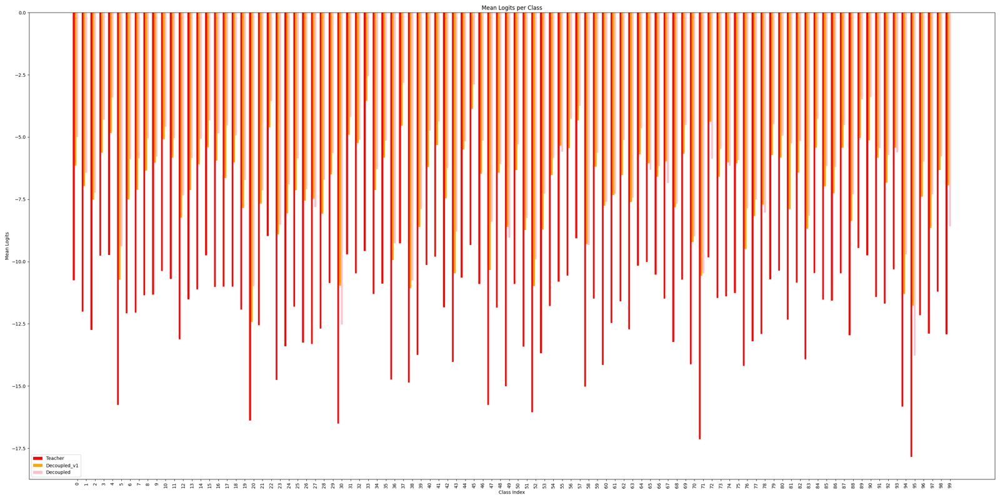

In recent times, knowledge distillation has become a go-to technique for transferring the “wisdom” of a large, well-trained teacher model into a smaller, more efficient student model. The question we ask: how best to transfer not just “what” the teacher predicts but also “how” it reasons?  

In this blog post we present our work on **Decoupled Gradient Knowledge Distillation (DGKD)** — an implementation inspired by the paper [Decoupled Knowledge Distillation (Zhao et al., 2022)](https://arxiv.org/abs/2203.08679) — and share both the intuition, our modifications, and takeaways.

### 🧠 Background: Why "Decoupled" Knowledge Distillation

The original DKD paper shows that the standard KD loss (e.g., the KL divergence between teacher and student logits) can be broken down into two parts:

- **TCKD (Target-Class Knowledge Distillation):** focuses on the predicted target class — how confident the teacher is on the “correct” class.  
- **NCKD (Non-Target-Class Knowledge Distillation):** covers all other classes, i.e., the “dark knowledge” of how the teacher distributes probability mass among wrong classes.

The key insights from the paper are:
- The "dark knowledge" (NCKD) is very important for good student performance; yet in many classical KD formulations it gets supressed. 
- By decoupling the two components, we gain more flexibility: we can can tune how much we emphasis TCKD vs NCKD. 

In short: we do not just want the student to "copy" the teacher's most-likely class, but also to learn the structure of confusion the teacher holds among the wrong answers. 

### 🚀 Our Project: Implementation + Extension
We built our codebase around the repository at github.com/omertafveez-2001/Decoupled-Gradient-Knowledge-Distillation
, implementing the core DKD loss and then experimenting with a novel coupling mechanism between the two branches of the loss.

#### What we did differently
- Instead of letting TCKD and NCKD purely operate independently, we introduced a coupling term: the mean-squared error (MSE) between gradients of TCKD and NCKD with respect to the student logits (or student model parameters).

- Interestingly, when we maximize this gradient‐MSE term (i.e., encourage the gradients of TCKD and NCKD to diverge / be different), we observed better performance.

- The effect:
    - The student’s target‐class logit confidence saturates (i.e., once it's confidently correct, further boosting confidence doesn’t shrink the loss further).
    - The student is strongly penalised (via higher loss) when the student is correct but the teacher is not — i.e., the model is forced to stay loyal to the teacher’s logit structure, not just prediction accuracy.
    - We observed faster “neural collapse” (class centres become tight, intra‐class variance shrinks) and more compact representations.

#### Why might this work?
- By maximising the gradient‐MSE, we force TCKD and NCKD to provide distinct training signals rather than redundant ones. This drives the student to learn complementary features: one focusing on sharpening target‐class confidence, the other on modeling the non‐target distribution structure.
- The saturation of the target‐class confidence prevents the student from becoming over‐confident (which often harms generalization).
- The strong alignment with teacher logit structure helps the student internalize the teacher’s view of class‐relationships — not just the final correct label.

#### 📊 Performance Comparison: Gradient-Decoupled KD vs. Decoupled KD

| Dataset                                 | Gradient-Decoupled KD | Decoupled KD |
| --------------------------------------- | --------------------- | ------------ |
| CIFAR-100 — ResNet50 → ResNet18         | **62.01%**            | 61.07%       |
| CIFAR-100 — ViT-S → ResNet18            | **58.64%**            | 57.31%       |
| CIFAR-100 — Self-Distillation ResNet18  | **62.35%**            | 61.53%       |
| CIFAR-100 — Self-Distillation ResNet50  | 53.39%                | **54.31%**   |
| CIFAR-100 — Self-Distillation ResNet101 | **55.94%**            | 48.99%       |
| CIFAR-100 — ShuffleNetV2 → ResNet50     | 55.49%                | **56.48%**   |
| CIFAR-100 — ShuffleNetV2 → ViT-S        | 55.56%                | **55.84%**   |
| ImageNet — ResNet50 → ResNet18          | **48.42%**            | 45.48%       |
| ImageNet — ResNet50 → ShuffleNet        | 44.90%                | **45.59%**   |
| ImageNet — ViT-S → ResNet18             | **41.81%**            | 41.57%       |
| ImageNet — ViT-S → ShuffleNet           | **39.74%**            | 39.42%       |
| ImageNet — Self-Distillation ResNet101  | **30.49%**            | 0.50%        |
| ImageNet — Self-Distillation ResNet50   | **48.09%**            | 48.06%       |
| ImageNet — Self-Distillation ResNet18   | **48.29%**            | 46.40%       |

✅ Bold entries indicate the student outperforming the original DKD baseline  
📌 DGKD improves on 10 out of 14 evaluated distillation settings

From the table above, we infered that our variant was not successful in ourperforming Decoupled KD in mobile networks or smaller CNN models such as ShuffleNetV2 and MobileNet, however it was still consistent across 10/14 experiments.

#### 🔍 Key Observations & Takeaways

From our experiments we noted:

- **Loss behaviour**: When the student’s target class logit is sufficiently confident (say probability 0.9 vs teacher 0.8) the overall loss doesn’t shrink further, i.e., it plateaus instead of chasing infinite confidence.

- **Teacher vs student mismatch penalty**: If the student predicts correctly but the teacher was less confident (or wrong) the coupling term spikes the loss. That means we’re enforcing fidelity to teacher’s distribution even when accuracy is achieved.

- **Representation compactness**: We saw that intra‐class features became more tightly clustered in embedding space compared to baseline KD methods, implying better generalization and faster convergence.

#### Logits Comparison between Teacher & DKD vs Teacher & Decoupled Gradient KD

We computed the Mean Squared Distance between teacher and the variants. The metrics are as follows:
- Teacher and DKD: 43.884
- Teacher and DGKD: 34.666

So our logits were significantly closer. 

### Future Work
- Disect the loss function and complete its derivation to further develop the understanding of the model's architectural differences (benefits and disadvantages). In doing so, it is highly important to understand the role of Non Target Class and Target Class Logits in this space.

- Continue the experimentation across more complex datasets in image classification: Animal10, and OOD Generalization (Scrambled, Noisy)

- Continue the experimentations across object detection datasets: MS COCO
