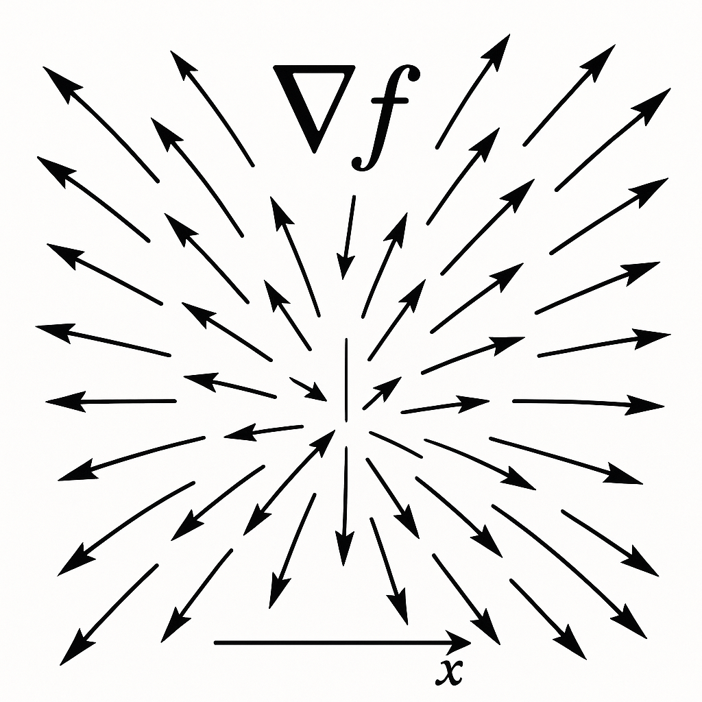

# Gradient Norm Collapse in Logit Distillation: Diagnosis and a Coupling-Based Remedy

---

## Motivation

Knowledge distillation (KD) has become a cornerstone technique for compressing large neural networks into smaller, deployable models. The canonical formulation — minimizing the KL divergence between teacher and student output distributions — is deceptively simple. Zhao et al. (2022) showed that this classical loss is actually a **coupled** formulation of two distinct objectives: Target Class Knowledge Distillation (TCKD), which transfers knowledge about prediction confidence on the correct class, and Non-Target Class Knowledge Distillation (NCKD), which transfers the "dark knowledge" embedded in the teacher's probability mass over wrong classes.

Their key finding was that NCKD is the dominant driver of distillation performance, yet classical KD suppresses it — the NCKD term is weighted by $(1 - p_t^\mathcal{T})$, which shrinks precisely when the teacher is most confident and, by their argument, most informative. DKD addresses this by decoupling the two terms and introducing independent weights $\alpha$ and $\beta$.

However, DKD leaves a deeper problem unaddressed. As the student converges toward the teacher's distribution, the KL divergence shrinks toward zero — and so do the gradients flowing from both TCKD and NCKD. **The distillation signal is self-extinguishing.** The better the student gets at mimicking the teacher, the less it learns from the teacher. This is not a DKD-specific failure — it is a fundamental property of any KL-based logit distillation loss. Our work is motivated by this observation: can we introduce a mechanism that actively sustains the distillation signal throughout training, rather than allowing it to decay?

---

## Theoretical Framework

Our approach is grounded in two bodies of work from convex optimization and deep learning theory.

**Neural Collapse and the MSE Loss Landscape.** Zhou et al. (2022) — *"On the Optimization Landscape of Neural Collapse under MSE Loss: Global Optimality with Unconstrained Features"* — provide a rigorous analysis of networks trained with Mean Squared Error loss under the unconstrained features model. Their central result is that the only global minimizers of the MSE loss correspond to the Neural Collapse solution: within-class features collapse to their class mean, class means form a Simplex Equiangular Tight Frame (ETF), and the linear classifier aligns with these means. Critically, they analyze a *rescaled* variant of MSE and show that rescaling sharpens saddle points, stabilizes the descent path, and accelerates convergence to the Neural Collapse solution. This has a direct implication: MSE, unlike cross-entropy or KL divergence, produces smooth, non-vanishing gradient contributions across all output dimensions simultaneously. Once a class probability approaches 1 under cross-entropy, gradient contributions from non-target classes effectively die. MSE does not exhibit this behavior.

**Gradient Diversity in Multi-Objective Optimization.** A complementary line of work in multi-task learning — including PCGrad (Yu et al., 2020) and GradNorm (Chen et al., 2018) — establishes that when gradients from different loss components are collinear, they provide redundant optimization signal and one objective tends to dominate. Enforcing gradient diversity across loss components encourages the network to develop representations that serve both objectives independently. In our setting, the two objectives are TCKD and NCKD, and their gradient interaction throughout training directly governs how well the student internalizes both the target-class structure and the dark knowledge over non-target classes.

---

## Main Idea

We propose **Decoupled Gradient Knowledge Distillation (DGKD)**, which augments the DKD loss with a coupling term that operates directly on the gradients of TCKD and NCKD with respect to the student logits. Rather than allowing the two loss components to interact only implicitly through shared parameters, we introduce an explicit regularizer that measures the divergence between their gradient signals.

### Loss Formulation

The standard DKD loss is:

$$
\mathcal{L}_{\text{DKD}} = \alpha \cdot \mathcal{L}_{\text{TCKD}} + \beta \cdot \mathcal{L}_{\text{NCKD}}
$$

We extend this with a scaled MSE coupling term between the per-sample gradients of TCKD and NCKD with respect to the student's target-class and non-target-class logits respectively:

$$
\mathcal{L}_{\text{DGKD}} = \alpha \cdot \mathcal{L}_{\text{TCKD}} + \beta \cdot \mathcal{L}_{\text{NCKD}} + \frac{\varepsilon}{n} \sum_{i=1}^{n} \left\| \nabla_{z_i^{s_{tc}}} \ell_t - \nabla_{z_i^{s_{ntc}}} \ell_s \right\|_2^2
$$

where:
- $\nabla_{z_i^{s_{tc}}} \ell_t$ is the gradient of the TCKD loss with respect to the student's target-class logit for sample $i$
- $\nabla_{z_i^{s_{ntc}}} \ell_s$ is the gradient of the NCKD loss with respect to the student's non-target-class logits for sample $i$
- $\varepsilon$ is the MSE scale parameter, empirically set to 6

The coupling term is **maximized** implicitly through the loss — by including it additively, the optimizer is encouraged to maintain large gradient differences between the two branches, which as we show below, has the effect of sustaining gradient norms throughout training.

**Why scaled MSE specifically?** Motivated by Zhou et al. (2022), we experimented with cosine similarity, KL divergence, and Wasserstein distance as coupling measures. None matched the stability of MSE. The rescaling factor $\varepsilon$ controls the curvature of the coupling term's loss landscape — too small and it has no sustaining effect; too large and it destabilizes training. At $\varepsilon = 6$, the coupling term operates in the regime described by Zhou et al. where the landscape curvature is well-conditioned.

---

## Hypothesis

We hypothesize that the primary failure mode of logit-based KD — including DKD — is **gradient norm collapse**: as the student converges toward the teacher's distribution, the KL-based losses produce vanishingly small gradients, and the distillation signal effectively dies before the student has fully internalized the teacher's representational structure.

Our coupling term addresses this by creating a tension between the TCKD and NCKD gradient streams. Formally, when both gradients decay symmetrically (as in DKD), their difference also shrinks — which reduces the coupling term's contribution to the loss — which the optimizer then corrects by increasing gradient magnitudes. This constitutes a **self-correcting mechanism against gradient norm collapse**, specific to the distillation setting.

A secondary hypothesis is that this mechanism should be more effective in networks with sufficient representational capacity to maintain orthogonal gradient subspaces for TCKD and NCKD simultaneously. In low-capacity networks, forcing gradient diversity in a compressed parameter space may cause destructive interference rather than complementary learning.

---

## Empirical Observations

### Gradient Norm Dynamics

The central empirical finding supporting our hypothesis is the gradient norm dynamics throughout training. We track the gradient norms of TCKD and NCKD separately for both DKD and DGKD on ResNet50→ResNet18, CIFAR-100.

In DKD, both the target-class and non-target-class gradient norms decay together and collapse to near-zero by epoch 14 — the distillation signal effectively extinguishes. In DGKD, the target-class gradient norm starts significantly higher (~0.15 vs ~0.075) and remains elevated throughout training, sustaining a meaningful learning signal well into late training. The non-target norm also starts higher and decays more gradually.

This is the mechanistic evidence for our hypothesis: **DGKD sustains gradient norms, DKD does not.**

### Gradient Similarity

A natural alternative explanation would be that our coupling term works by enforcing gradient orthogonality between TCKD and NCKD — forcing the two loss components to provide genuinely distinct directions in parameter space. We tested this directly by measuring the cosine similarity between $\nabla \mathcal{L}_{\text{TCKD}}$ and $\nabla \mathcal{L}_{\text{NCKD}}$ across training for both methods.

The similarity curves for DKD and DGKD are nearly indistinguishable — the gradients are already near-orthogonal in both cases throughout training. This rules out gradient orthogonality as the operative mechanism. The improvement is not about changing the *direction* of gradient interaction — it is purely about sustaining gradient *magnitude*.

When the gradients are already orthogonal, maximizing $\|\nabla \ell_t - \nabla \ell_n\|^2 \approx \|\nabla \ell_t\|^2 + \|\nabla \ell_n\|^2$. The coupling term is therefore functioning as a **gradient magnitude amplifier** that is direction-neutral — boosting how strongly the student learns from both components without altering what it learns from each.

---

## What Went Wrong? What Does the Study Entail Now?

Our original results were obtained under non-standard training conditions: approximately 8 epochs, without warmup, without the DKD paper's recommended LR schedule (step decay at epochs 150, 180, 210), and with unverified hyperparameters. Under these conditions, no model converges and the reported accuracy numbers are not meaningful baselines relative to the published DKD results.

When re-run under correct conditions — SGD with momentum 0.9, weight decay 5e-4, LR 0.05 with step decay, temperature 4, $\alpha=1.0$, $\beta=8.0$, 20-epoch warmup — DKD outperforms our method on an initial sanity check. This raises three distinct possibilities:

**1. The improvement was an artifact of unconverged training.** Our coupling term may help in the early training regime where gradient norms are rapidly changing, but provide no benefit — or actively hurt — once training stabilizes under a proper schedule.

**2. The scale parameter $\varepsilon=6$ was tuned to the broken setup.** The optimal coupling strength under short-horizon training may differ substantially from the optimal under full training. This is a likely explanation given that the parameter was found empirically without cross-validation under standard conditions.

**3. The mechanism is real but operates at a different scale.** The gradient norm sustenance we observe may still be occurring under proper training, but the benefit may be smaller than the noise introduced by a suboptimally-scaled coupling term.

Distinguishing between these requires a systematic seed experiment and scale sweep under proper training conditions, which is the current focus of ongoing work.

---

## Limitations

**Hyperparameter sensitivity.** The coupling term introduces a single additional parameter $\varepsilon$, but performance degrades both above and below $\varepsilon=6$ in our original experimental setup. This sensitivity to a single hyperparameter is the primary obstacle to claiming a robust mechanism rather than a tuned configuration.

**No theoretical derivation of the optimal scale.** We do not have an analytical characterization of why $\varepsilon=6$ is optimal, or how the optimal scale should vary with architecture, learning rate, or temperature. Zhou et al.'s landscape results suggest the optimal scale relates to the curvature of the loss surface, but connecting this to our inter-gradient coupling term formally remains open.

**Capacity dependence.** Our secondary hypothesis — that the mechanism fails in low-capacity networks because they cannot maintain orthogonal gradient subspaces — is consistent with the failure pattern on ShuffleNetV2 and MobileNet.

---

## Future Work

- **Theoretical derivation of the optimal scale.** Connecting the optimal $\varepsilon$ to properties of the training dynamics — loss magnitude, learning rate, temperature — would convert an empirical finding into a principled design choice and substantially strengthen the contribution.

- **Formal characterization of gradient norm collapse.** Proving that KL-based distillation losses produce gradient norms that decay at a rate proportional to the KL divergence reduction, and showing that the coupling term provides a provable lower bound on gradient norm magnitude, would constitute the theoretical core of a publishable result.

- **Extension to broader architectures and datasets.** Validation on ImageNet at full training, MS-COCO object detection, and architectures beyond the ResNet family is necessary before any general claims can be made.

- **Applying the coupling term to vanilla KD.** If the mechanism is gradient norm sustenance rather than a DKD-specific fix, the coupling term should improve vanilla KD as well. This experiment would distinguish a general KD improvement from a DKD-specific one and is a strong test of the core hypothesis.