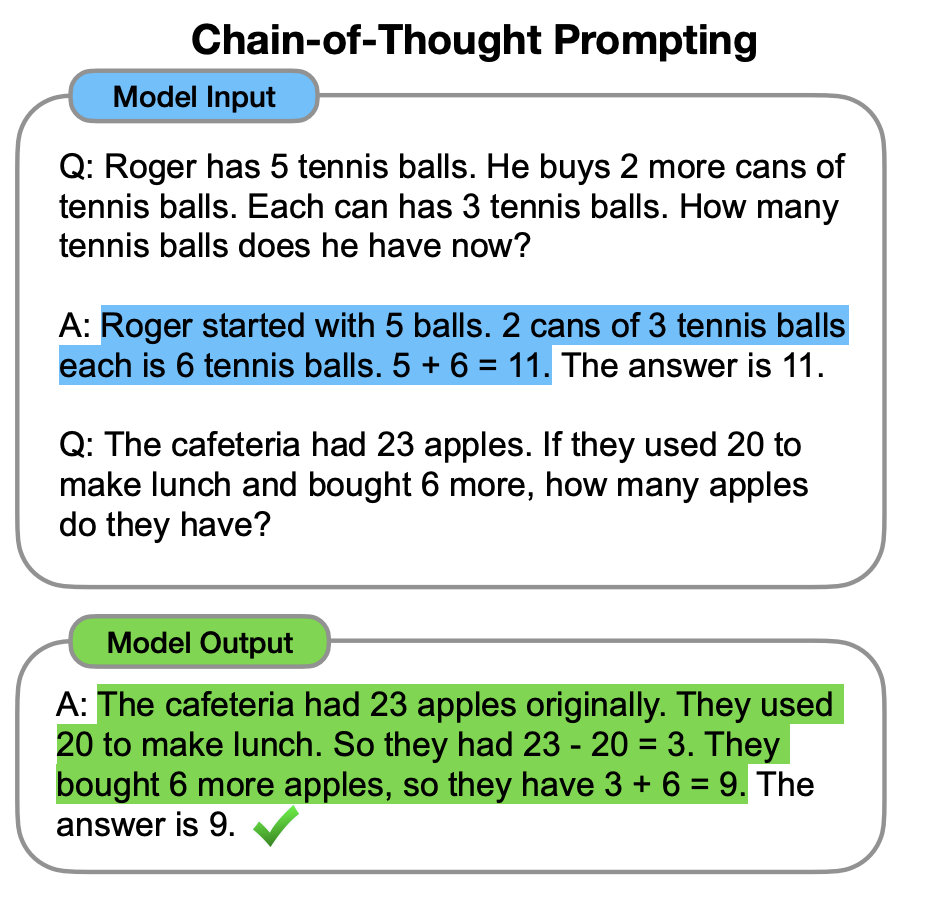

<p style="text-align: center;">
  "Large Language Models are pattern matchers and stochastic machines."
</p>
This is what I thought initiailly, when I started to work on Language Models. But there is much to it. In the past 5 years, we have seen plenty of work in AI Safety, and Reasoning. So one could really ask, <i>"What exactly is Reasoning"?</i> or <i>"What is AI Safety in LLMs"?</i> <br> <br>

> **Reasoning** in LLMs refers to the model's ability to perform structured, step-wise, logically coherent inference that goes beyond surface-level pattern matching, allowing the model to solve problems via multi-step computation, planning, abstraction, and generalization ~ <i>GPT-5 Instant Response</i> <br> <br>

Well there is a reason why, I deliberately attach a GPT response, because maybe MAYBE... GPT-5 does not <i>reason<i> that well. And that is because this definition sounds *true* but is definitely not academically *true*. Let us also think step-by-step. <br> <br>

1. How does Human Reasoning differs compared to LLM Reasoning <br>
Humans use neural-symbolic reasoning: a mixture of intuition and explicit symbolic manipulation. The brain supports working memory, goal-directed planning, and causal models. We can apply rules, logic, and abstraction deliberately. <br>
LLMs perform next-token prediction using a statistical function learned from large corpora. All "reasoning" emerges from pattern completion, not explicit symbolic rules. LLMs do not maintain persistent working memory; they rely on the context window and hidden activations. 

2. Reasoning in LLMs is not as simple.<br>
*Setting*: Imagine you are sitting in an exam, and for some very *weird* reason, you somehow knew that the question you are about to attempt is almost the same as the question from previous examination (maybe in the previous year or semester), so you try to copy the previous answer that you had memorized to ensure it resembles marking scheme. <br>
In a very similar fashion, in LLMs, we call it **Reward Hacking**. That is, that LLMs somehow learns to bypass the cost function by hacking the problem, and pretending that it is solving the problem. Sounds a bit *confusing* right? It was confusing to me as well. <br>
Let's take a coding problem: 

``` python
def add(a, b, target):
  return (a + b) == target
```

Suppose this is the function that the LLM is supposed to generate. It may fail some tests, and it might not. But what if it generates this
```python
def add(a, b, target):
  return True
```
It probably will pass more than 50% of the test cases. This is reward hacking. 

### **System 1 vs System 2: Association vs Deliberation**
Borrowing from cognitive science, LLM behaviour mirrors System 1 thinking -- fast, associative, pattern based (recalling factual knowledge). <br>
True multi-step reasoning, analogous to System 2 deliberation, demands:
1. Representation of intermediate states (a mental scratchpad)
2. Logical dependency tracking
3. Dynamic allocation of computation proportional to task difficulty. 
Early Transformer models lacked these properties because their computation depth is fixed: every problem receives the same number of forward passes regardless of complexity. Thus, “thinking longer” was architecturally impossible.

### **The role of In-context Learning**
The discovery of in-context learning (ICL) revealed that sufficiently large models can learn new tasks purely from prompts—no parameter updates needed. However, ICL only becomes robust beyond certain scale thresholds (tens of billions of parameters) <br>
Smaller models can mimic patterns but fail to generalize relational structure across tasks. This observation seeded a core hypothesis repeated throughout reasoning research:
> Reasoning abilities emerge when model scale × data diversity × prompt structure exceed a critical threshold. <br><br>

Because LLMs are, by nature, static pattern engines, researchers sought to force structure into their thought process: to make the model externalize intermediate reasoning, reuse prior logic, and self-correct when diverging.<br><br>

This led to a family of methods that can be organized thematically<br>
In the sections that follow, we will track this evolution thematically—from explicit reasoning traces to self-aware deliberation frameworks—analyzing not only what worked but why each innovation succeeded or failed, and what it reveals about the illusion (or emergence) of machine thought.

## **Explicit Intermediate Reasoning**
> Reasoning abilities are not emergent accidents; they are trained statistical habits of expressing thought.

### Show your work: Scratchpads (2021, Google Research - Brain Team)

Before "Chain-of-Thought" existed, *Show your Work (Nye et al., 2021) tackled a simple question: 
> Can Transformers perform multi-step computation if we explicitly make them write intermediate steps?

The answer arrived through **Scratchpads**: texual traces inserted between input and output. Instead of forcing a single forward pass, the model learned to externalize its computation in human readable form. <br> <br>
**Method** <br>
- Each training example contained the **intermediate algorithmic trace** of a Python program. 
- The model predicted not only the final answer but also the full execution trace: 
  - The order of source lines executed
  - The state of local variables after each line. 
This process was called a *trace exact match* evaluation: semantic comparision of predicted and ground-truth traces + sequence alignment of executed lines.<br>
**Findings** <br>
Scratchpads improved performance on synthetic tasks but failed on MBPP (Mini Python Benchmark Programs). Why? <br>
- MBPP was too small (~ 400 trainin examples)
- Transformers are pattern matchers -- without ample scratchpad-style examples, they fail to generalize to the format (**RECALL IN CONTEXT LEARNING HERE**) <br>
To fix this, the authors built **MBPP-Aug** via data augmentation:
- A 137 B-parameter model generated ≈ 80 candidate programs per task at T = 0.5.
- Each program was executed on original inputs to filter failures.
- Execution traces were recorded for successful programs. <br>

**Result**: Scratchpads scaled successfully with dataset size — a clear hint that reasoning is a data-driven phenomenon. 

My take on this paper:
> Reasoning abilities are a result of large datasets having scratchpad-like examples, not just the emergent abilities of Transformer. 

Why?
- Smaller datasets limit the model's ability to infer the format of multi-step reasoning. 
- This invites a test: could Scratchpads be implemented on non-Transformer architectures (RNNs with external memory, diffusion models over traces)?

### Chain-of-Thought Prompting (2022, Google Research -- Brain Team)
<p align="center">
  
</p>
LLMs can "reason" if we make them explain their answers. **Chain-of-Thought (CoT)** prompting introduces a natural-language "reasoning-chain" between question and answer. <br>
Few-shot CoT requires only a handful of exemplars like:

``` vbnet
Q: If there are 3 cars and each has 4 wheels, how many wheels?
A: Each car has 4 wheels -> 3x4 = 12 -> 12. 
```
This seemingly simple pattern doubles performance on multi-step benchmarks. This taught models to narrate their reasoning. Large Models suddenly solved multi-step arithmetic and commonsense problems far better, while smaller ones produced nonsense chains that hurt accuracy. <br>
Manual insepction revealed something deeper: some mathematically wrong chains still produced correct answers by conincidence. *This hinted that LLMs were not truly reasoning; they were sampling statistically plausible stories of reasoning* <br><br>

Ablations clarified the mechanism:<br>
- **Equation-only prompting** helped for single-step math but failed for semantic tasks.
- **Variable-compute prompting** gave inconsistent results; length is not a good awat proxy for congitive effort.
- **Post-answer chains** offered no gain, showing that the process of reasoning, not just recalling facts, drives success. 

**Experiments & Datasets**
Models: GPT-3, LaMBDA, PaLM, UL2 20B, Codex <br>
Datasets: GSM8K, SVAMP, ASDiv, AQuA, MAWPS <br>
Authors hand-crafted 8 few-shot CoT exemplars covering arithematic and commonsense reasoning. <br> <br>

**Key Findings**
- CoT improves performance **only for large models (> 100B)**
- Smaller models produce illogical chains that hurt accuracy relative to standard prompting
- Gains are largest on multi-step tasks (GSM8K, StrategyQA); negligible on simple arithematic (SingleOp MAWPS) <br><br>
Manual inspection showed that some correct answers arose from **incorrect reasoning** (*lucky conincidence* right?). So maybe LLMs weren't yet "reasoners" -- they imitated the surface pattern of reasoning. <br>


### Zero-Shot CoT  (2022, Google Research)
Few-shot CoT needed human examples. <br>
Zero-Shot CoT eliminited them with the trigger phrase:
> Let's think step by step.

<br>
The model first generates a reasoning trace $z$, then re-prompts with the trace to obtain the final answer. <br>
This “double prompting” works astonishingly well for huge models like PaLM 540 B, but smaller ones barely benefit. <br>
Temperature sampling sometimes rescues a poor reasoning path—an accidental discovery that stochastic decoding performs a kind of search over possible thoughts. <br>

This can be interpreted as evidence that **reasoning = search** in text space.

Temperature controls exploration breadth, letting the model stumble into valid logical sequences. Thus, even without curated exemplars, reasoning can be elicited linguistically if the model is large enough to internalize the pattern.

### What explicit reasoning taught us
From Scratchpads to Auto-CoT, a pattern emerges.
LLMs can reason only when we externalize reasoning as text and feed them examples of it.
Once the “format of thought” becomes part of the training distribution, they learn to reproduce it.

**Key Insights**:
- **Reasoning is data-driven**. Scale × diversity × explicit structure = ability.

- **Language is computation**. The model’s own text serves as its working memory.

- **Search beats static prompting**. Temperature, sampling, and automated demonstration selection act like exploration policies.

- **Faithfulness is the next frontier**. A correct answer isn’t enough; we must align the reasoning path with truth.

What I think about is, that LLMs are statistical reasoners, then teaching them to write down their statistical reasoning is how we make them look rational. Explicit intermediate reasoning does not make models think, it makes their stochastic prediction process legible. <br>

What follows in the next section, is how researchers pushed beyond single-pass reasoning toward *hierarchical decomposition* and *compositional thought*. 


